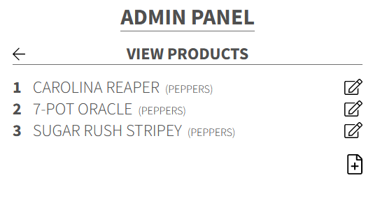
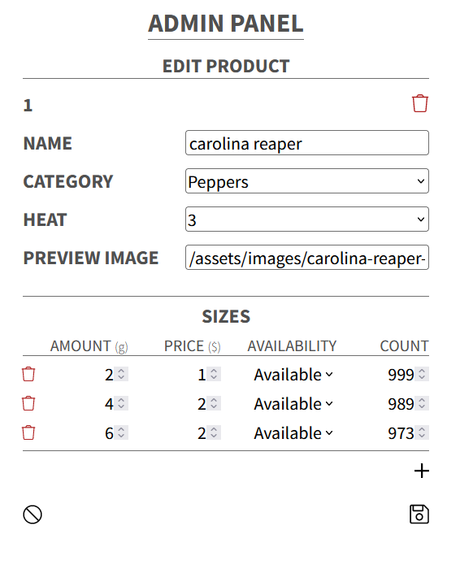
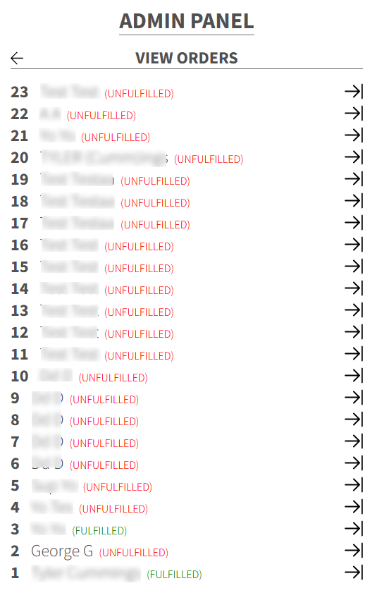
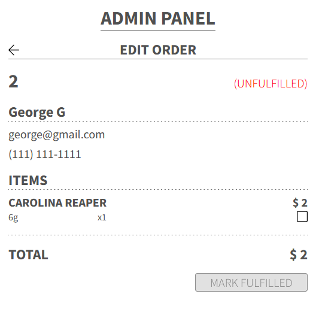
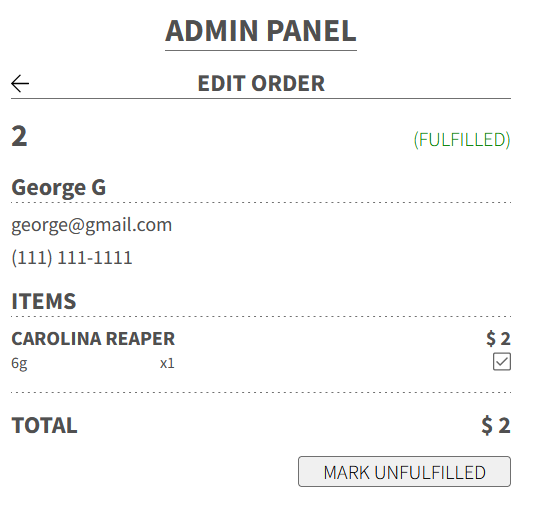

# EDMONTON EMBER

This website consists of four components: user, admin, admin_login, and the backend.

## /user

The program for the user interface which customers will use.

## /admin_login

Login for the admin panel. You must access this page first to login in order for the actual admin panel to be sent to you.

## /admin

The admin panel. This is where products can be added, edited, etc. This is also where orders can be viewed and fulfilled.

### Screenshots

#### /admin/products

#### /admin/products/:id

#### /admin/orders

#### /admin/orders/:id

## /backend

The Flask application which controls the API of the website. It also is responsible for sending static javascript and css files and allowing or disallowing the admin panel to be sent to the client.

## TODO

* Customers should confirm orders with links sent to their emails
    * If they do not confirm the order within a certain time period, the order is cancelled and products are added back to stock
    * Need cron jobs and another python script for this
    * Also need to add more states to orders other than unfulfilled/fulfilled
* Viewing orders that have been placed
    * Cancelling orders that have been placed
* Error message popups